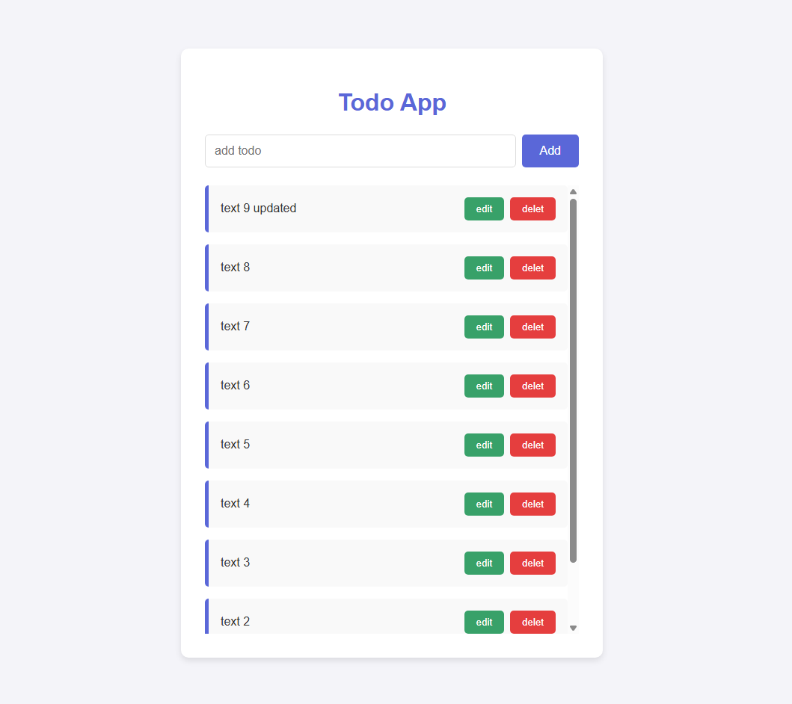

# Todo-App

This is a simple and elegant todo application built to demonstrate asynchronous JavaScript operations. It allows you to manage your tasks by interacting with a mock API, making it a great example of how to handle CRUD (Create, Read, Update, Delete) functionality in a web application.
<br>

<hr>

## Features

- **Add new todos:** Quickly add new tasks to your list.
- **Edit existing todos:** Update your tasks as they change.
- **Delete todos:** Remove completed or unnecessary tasks.
- **Asynchronous operations:** All operations are handled asynchronously to ensure a smooth user experience without reloading the page.
- **Clean UI:** The interface is designed to be simple and intuitive.
<br>
<hr>

## How to use

1. **Clone the repository:**
   ```bash
   git clone https://github.com/your-username/todo-app.git
   ```
2. **Navigate to the project directory:**
   ```bash
   cd todo-app
   ```
3. **Open `index.html` in your browser:**
You can do this by right-clicking the file and selecting "Open with" your favorite browser, or by using a live server extension in your code editor.
<br>
<hr>

## How it looks



<br>
<hr>
<br>

## Technologies Used

- HTML
- CSS
- JavaScript
- [MockAPI](https://mockapi.io/)
<br>
<hr>

## Code Overview

- **`index.html`:** The main structure of the web page.
- **`index.css`:** The styling for the application.
- **`index.js`:** The core logic of the application, including:
  - **`fetchData()`:** Fetches all todos from the API and displays them.
  - **`postData()`:** Adds a new todo to the API.
  - **`deleteData()`:** Deletes a todo from the API.
  - **`updateData()`:** Updates an existing todo in the API.
  <br>
  <hr>
